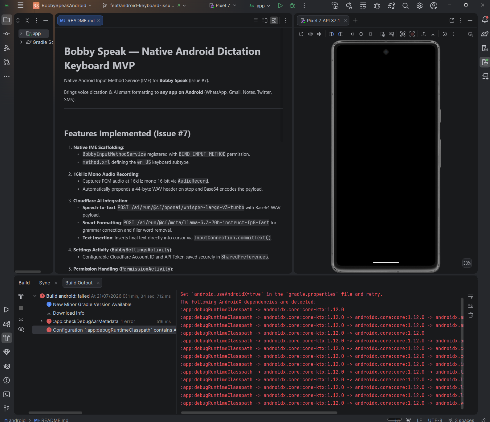
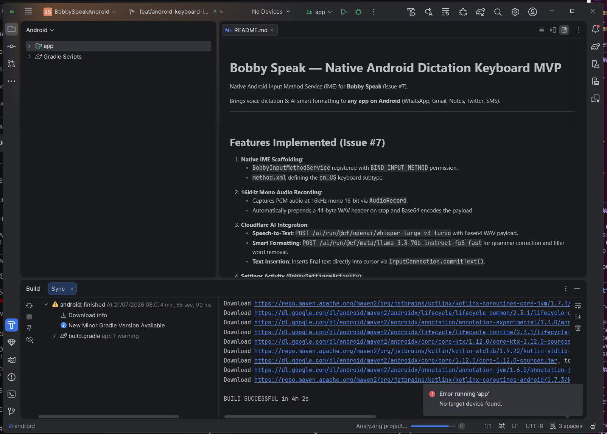
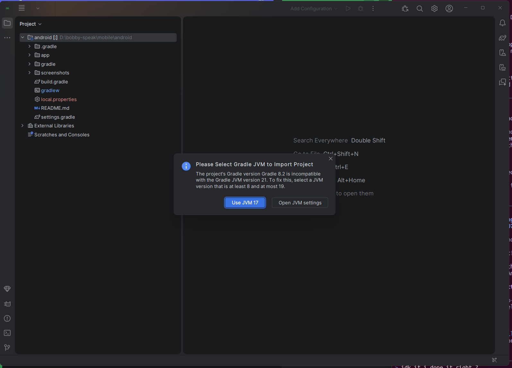

# Bobby Speak Android Keyboard — Screenshots & UI Guides

This folder contains screenshots and layout documentation for the **Bobby Speak Native Android Dictation Keyboard (Issue #7)**.

## Screenshots

### 1. Pixel 7 Emulator Running in Android Studio

*Shows the Pixel 7 emulator booted and active alongside Android Studio.*

### 2. Build Successful

*Shows Android Studio Gradle sync and build completing successfully (`BUILD SUCCESSFUL in 4m 2s`).*

### 3. Android Studio Project Import

*Shows opening `mobile/android` directly in Android Studio with JVM 17 configuration.*

---

## Local SDK Properties Configuration

For **Android Studio on Windows**, the `local.properties` file must be located at `mobile/android/local.properties`:

```properties
# Windows Android Studio SDK Path
sdk.dir=C\:\\Users\\clark\\AppData\\Local\\Android\\Sdk
```

---

## Keyboard Layout Architecture

```
+-------------------------------------------------------------+
| 🔴 Recording audio (16kHz mono)...                          |
+-------------------------------------------------------------+
| [ 🎤 Dictate / Stop ]   |   [ ⚙ Settings ]                |
+-------------------------------------------------------------+
| [ Space ]               |   [ ⌫ Delete ]                  |
+-------------------------------------------------------------+
```
