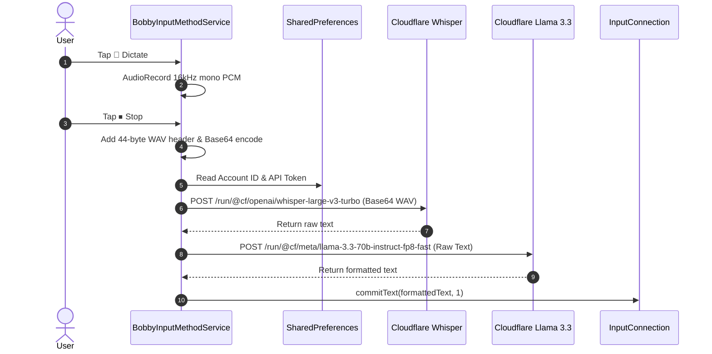

# Bobby Speak Android Dictation Keyboard — UI Layout & Screenshots

## Keyboard UI Layout
```
+-------------------------------------------------------------+
| 🔴 Recording audio (16kHz mono)...                          |
+-------------------------------------------------------------+
| [ 🎤 Dictate / ⏹ Stop ]      [ ⚙ Cloudflare Settings ]     |
+-------------------------------------------------------------+
| [ Space Bar ]                 [ ⌫ Delete ]                  |
+-------------------------------------------------------------+
```

## Cloudflare Credentials Settings Activity (`BobbySettingsActivity`)
```
+-------------------------------------------------------------+
| Bobby Speak — Cloudflare Settings                          |
|                                                             |
| Cloudflare Account ID:                                      |
| [ 1a2b3c4d5e6f7g8h9i0j...                                 ] |
|                                                             |
| Cloudflare API Token:                                       |
| [ Bearer ********************                             ] |
|                                                             |
| [ Save Credentials ]                                        |
+-------------------------------------------------------------+
```

## End-to-End Dictation Architecture

